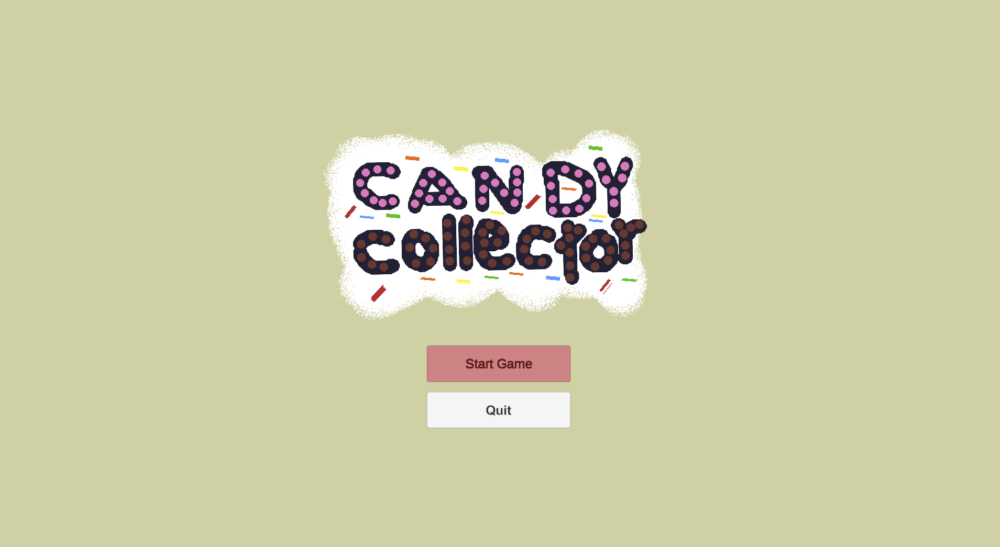
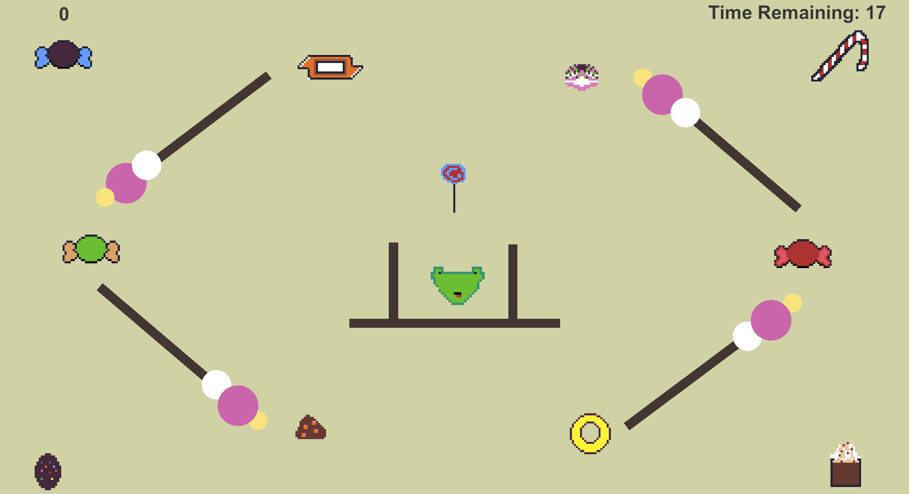
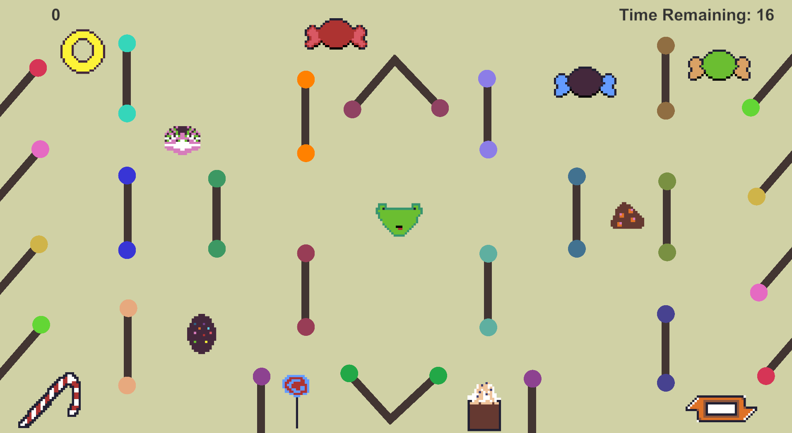

# 🍬 Candy Collector

**Candy Collector** is a fun and colorful arcade-style game built using **C#** and the **Unity Engine**.  
Your goal is simple — collect as many candies as you can before time runs out! 🍭  

Dodge obstacles, grab treats, and rack up a sweet high score!

👉 **Play it now on itch.io:** [https://fadhelalmalki.itch.io/candy-collector](https://fadhelalmalki.itch.io/candy-collector)

---

## 🎥 Game Preview

---

## 🧩 Features

- Cute pixel-art candy visuals 🍭  
- Smooth character controls 🕹️  
- Countdown timer ⏳  
- Score tracking system 🧮  
- Replayable for high-score challenges 🏆  

---

## 🎮 How to Play

1. **Start the Game:** Click the **Start Game** button on the title screen.
2. **Move the Character:** Use the arrow keys (⬆️⬇️⬅️➡️) or WASD to move your candy collector.  
3. **Collect Candies:** Move over candies to collect them and increase your score.  
4. **Time Limit:** You have limited time to grab as many candies as you can!  
5. **Game Over:** When time runs out, your final score will be displayed.

## 🖼️ Screenshots

| Game Background | Game Start |
|---------------|-----------|
|  |  |

| Level 1 scene | Level 2 scene |
|----------------|-------------|
|  |  |

